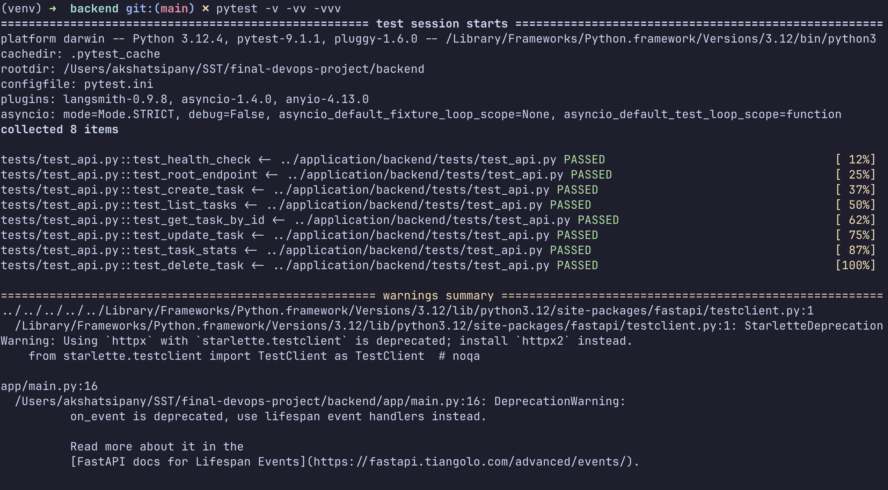
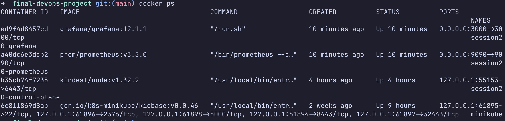
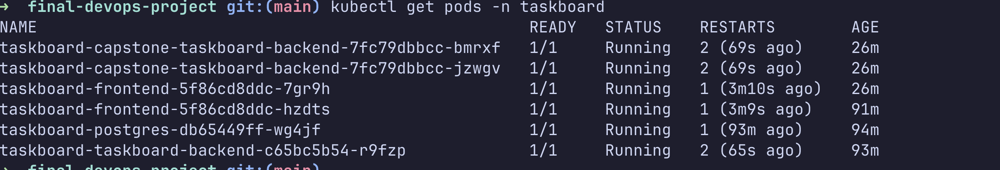
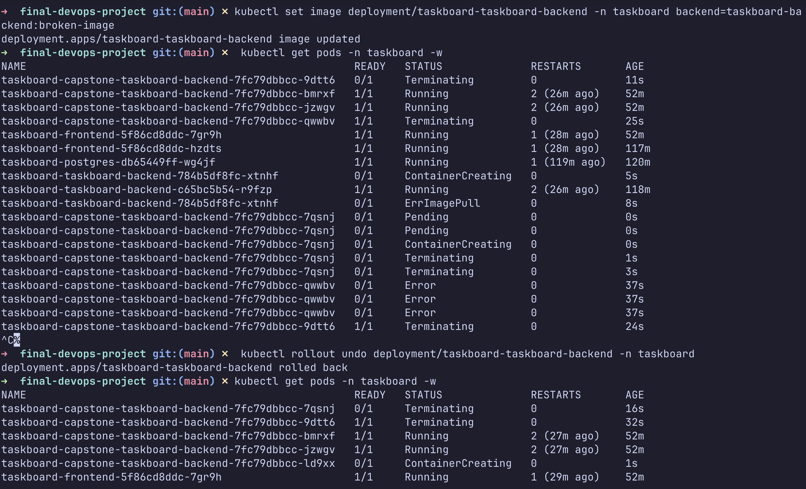

# Session 21 - Final DevOps Project

This project demonstrates a complete DevOps workflow using Docker, Kubernetes, Terraform, and a FastAPI-based backend. It covers container orchestration, infrastructure provisioning, deployment validation, and rollback handling in a real-world setup.

## Project Overview

The final project includes:

- Dockerized application services
- Kubernetes deployment in a local cluster
- TaskBoard application running in the `taskboard` namespace
- FastAPI backend with CRUD operations
- Terraform-managed infrastructure provisioning
- Automated validation using `pytest`

## Technologies Used

- Docker
- Kubernetes / `kubectl`
- Terraform
- FastAPI
- PostgreSQL
- Python 3.11
- Pytest

## Deployment Workflow

1. Start the required containers and services with Docker.
2. Verify the cluster and running workloads with `kubectl`.
3. Deploy the application to the Kubernetes namespace.
4. Validate the backend API with automated tests.
5. Provision and test infrastructure using Terraform.
6. Roll back or recover from a broken image deployment when needed.

## Useful Commands

```bash
docker ps
kubectl get pods -n taskboard
kubectl get all -n taskboard
pytest -q
terraform init
terraform validate
terraform plan
terraform apply
```

## Screenshots

### Docker services running



### Kubernetes pods in the taskboard namespace



### Backend API test results



### TaskBoard application UI



## Key Learnings

- Containerization helps standardize application runtime environments.
- Kubernetes provides orchestration, health checks, and service discovery.
- Terraform enables repeatable infrastructure creation and change tracking.
- Application validation is essential before and after deployment.
- Rollback strategies are important when a deployment fails or a bad image is introduced.

## Result

The project was successfully deployed and validated with all required services running, the backend passing its API tests, and the application accessible through the Kubernetes taskboard deployment.
