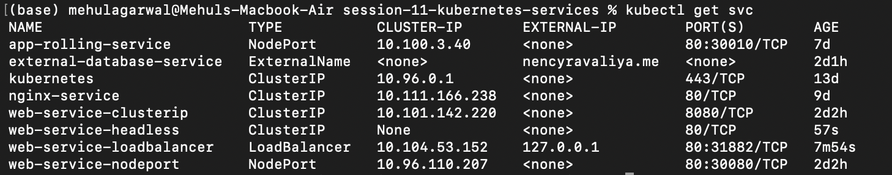

# Session 11: Kubernetes Services

This session covers the main Kubernetes Service types and how applications are accessed inside and outside the cluster.

## Services Overview

## 01. ClusterIP Service

A ClusterIP Service provides internal access to pods from within the Kubernetes cluster.

## 02. NodePort Service

A NodePort Service exposes an application on a port available on each Kubernetes node.

## 03. LoadBalancer Service

A LoadBalancer Service provides an externally accessible endpoint through a load balancer.

## 04. ExternalName Service

An ExternalName Service maps a Kubernetes Service name to an external DNS name.

## 05. Headless Service

A headless Service uses `clusterIP: None` and allows DNS discovery of individual StatefulSet pods.

