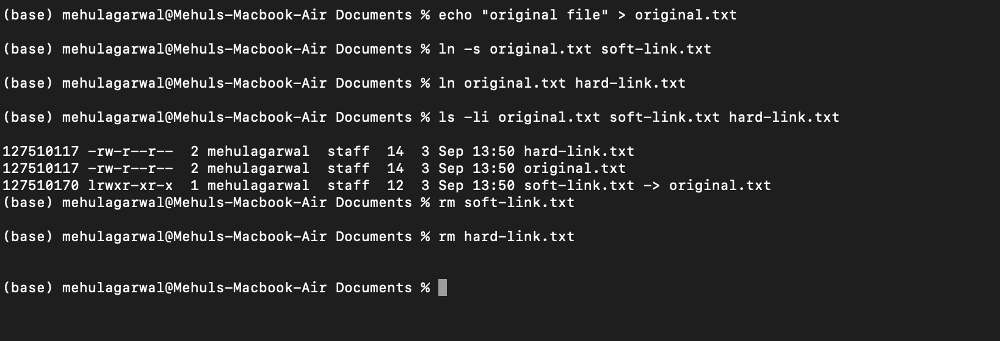
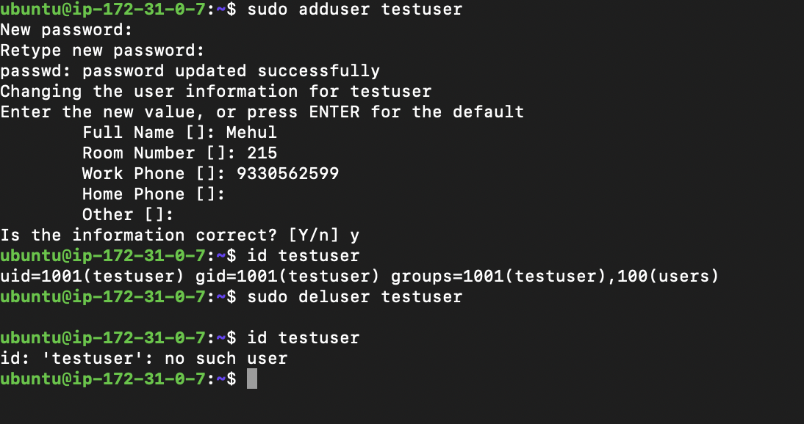
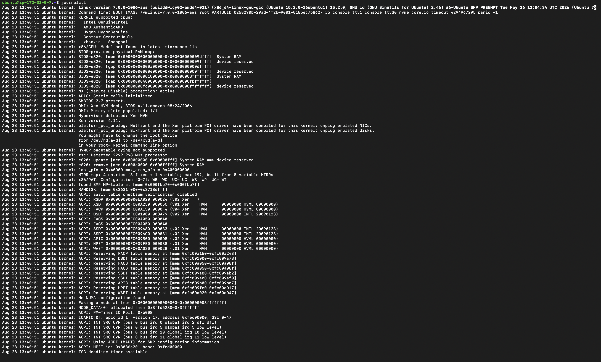
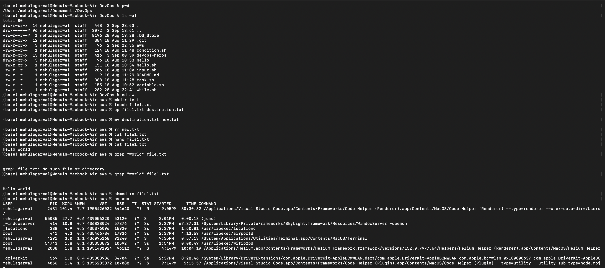
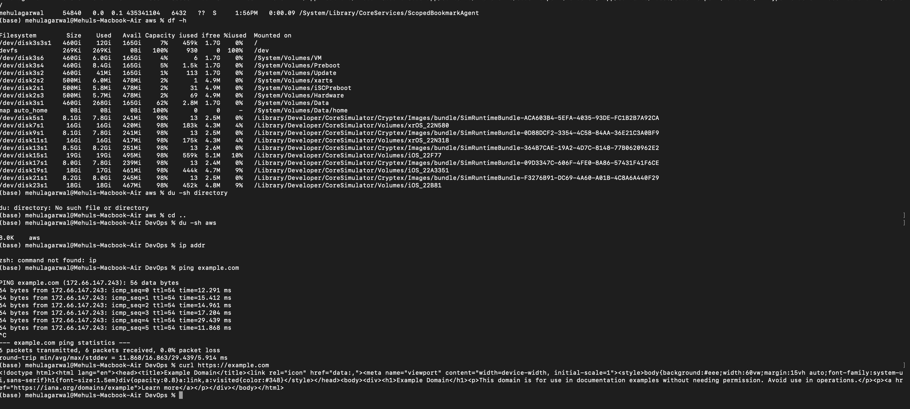

# Linux Homework Screenshots

## Soft Link and Hard Link

A soft link stores the path to another file, while a hard link points to the same inode as the original file.

Commands used: `ln -s original.txt soft-link.txt`, `ln original.txt hard-link.txt`, and `rm` to delete the links.

## adduser vs useradd

`adduser` is the recommended interactive command on Ubuntu because it creates the user home directory and guides the setup; `useradd` is the lower-level utility.

Command used: `sudo adduser testuser`.

## journalctl

`journalctl` displays logs collected by `systemd-journald`; `journalctl -u ssh` filters logs for the SSH service.

## Linux Command Cheat Sheet

The cheat sheet covers common file, permission, process, storage, and networking commands used for Linux administration.

