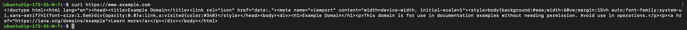
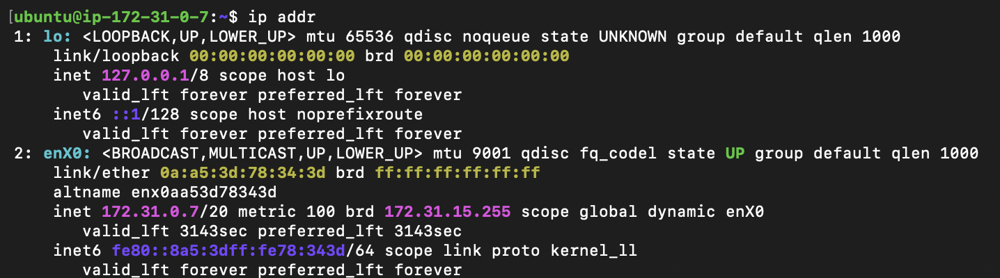
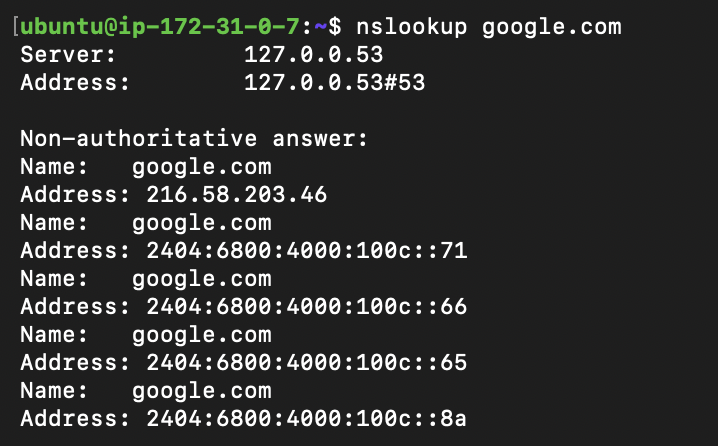
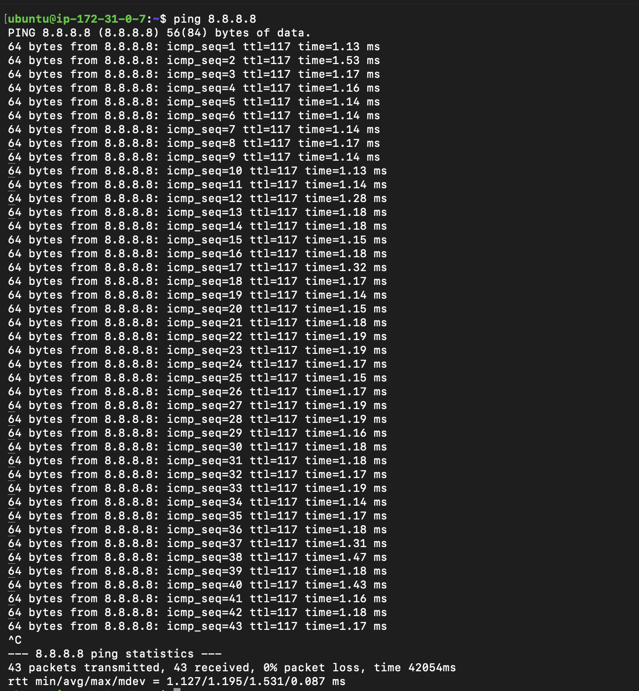
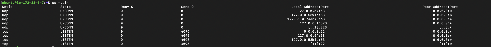
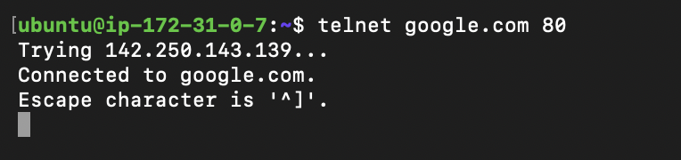
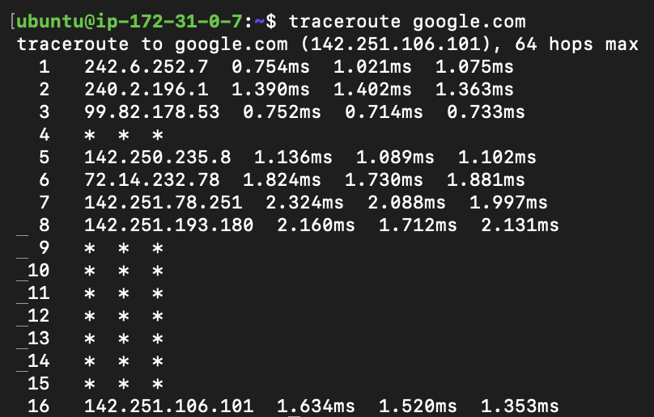

# Session 4: Networking Commands

## `curl https://www.example.com`

Fetches data from a URL and, with `-I`, displays the response headers.

## `ip addr`

Displays the network interfaces, IP addresses, MAC addresses, and interface status.

## `nslookup google.com`

Queries DNS to find the IP addresses associated with a domain name.

## `ping 8.8.8.8`

Tests network reachability and measures the response time to a destination.

## `ss -tuln`

Lists listening TCP and UDP network sockets with numeric addresses and ports.

## `telnet google.com 80`

Tests whether a TCP connection can be established to a host and port.

## `traceroute google.com`

Shows the network hops and response times between the local machine and a destination.

