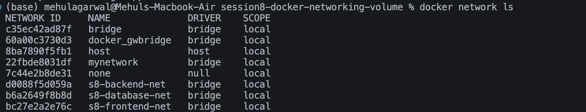
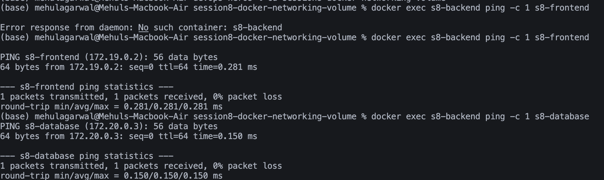
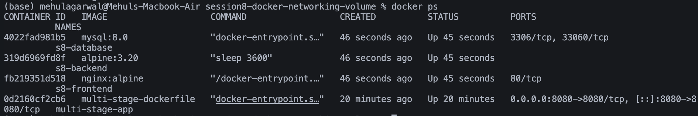
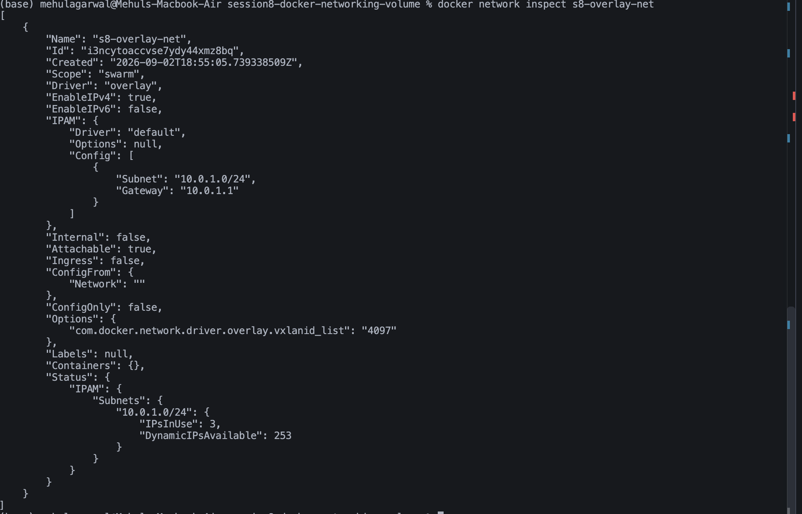

# Docker Networking and Volumes

## Task 1: Container Networking

### Docker Network List

### Container Connectivity

## Task 2: Host Network

## Task 3: Bind Mount

### Initial Page

### Updated Page Without Restart

## Task 4: Overlay Network

